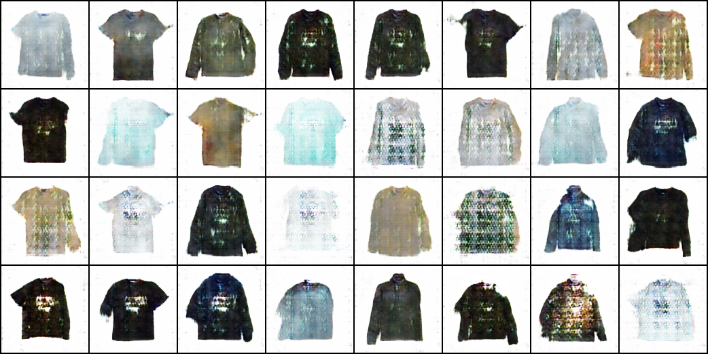

Clothes image generation using GAN(Generative Adversarial Network), to be more specific, DCGAN (Deep Convolutional Generative Adversarial Network).

## Results
it's more like clothes from trash can 🤣

## Real Colthes Images
### Image Acquisition

Total **~3000** real clothes images are from various clothing brands' online shop or e-commerces such as ZARA, Lativ, REVOLVE, Beams ... and so on.

All images were scraped using Chrome extension `Image downloader` for batch downlaoding images from webpages. Then select and collect manually.

It's worth noticing that we only use image with **white background** and **without model**.

### Image pre-processing

### Image processing before entering GAN

## Model Architecture

### Generator

### Discriminator

## Reference
- [Pytorch DCGAN tutorial](https://pytorch.org/tutorials/beginner/dcgan_faces_tutorial.html)
- [【機器學習2021】生成式對抗網路 (Generative Adversarial Network, GAN) (二) – 理論介紹與WGAN](https://www.youtube.com/watch?v=jNY1WBb8l4U&list=PLJV_el3uVTsMhtt7_Y6sgTHGHp1Vb2P2J&index=15)
