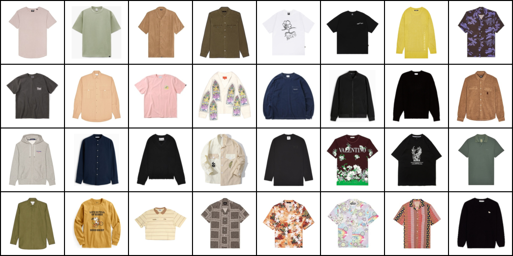

#### Clothes image generation using GAN(Generative Adversarial Network), to be more specific, DCGAN (Deep Convolutional Generative Adversarial Network).

## Result
it's more like clothes from trash can 🤣

 

## Real Colthes Images

### Image Acquisition

Total **~3000** real clothes images are from various clothing brands' online shop or e-commerces such as ZARA, Lativ, REVOLVE, Beams ... and so on.

All images were scraped using Chrome extension `Image downloader` for batch downlaoding images from webpages. Then select and collect manually.

It's worth noticing that we only use image with **white background** and **without model**.

### Image pre-processing
There exist some problem in the collected image

1. object (cloth) is not at the center of image
    
    

2. size of white padding between object and border is different amoung different source website.

    
    
    
To deal with these problem, we use a pre-process step to make sure object is at the center and the size of white padding is the same:

1. turn image into grey scale and remove white background (250 - 255)
2. find object's contour
3. crop image with the border of contour
4. extend the border to make sure every side is 1.2 * (max border side) -> this can make image square

( step 1-3 is from ` reference 3 ` )

|before|after|
|------|-----|
|||
||
|||

### Image processing before entering GAN
resize image to square `128*128`

 

## Model Architecture
both Generator and Discriminator are modified based on ` reference 1 `

### Generator

|overall with hyperparameters of each layer| output tensor size and params of each layer|
|---|---|
|||

### Discriminator

|overall with hyperparameters of each layer| output tensor size and params of each layer|
|---|---|
|||

 

## Reference
1. [Pytorch DCGAN tutorial](https://pytorch.org/tutorials/beginner/dcgan_faces_tutorial.html)
2. [【機器學習2021】生成式對抗網路 (Generative Adversarial Network, GAN) (二) – 理論介紹與WGAN](https://www.youtube.com/watch?v=jNY1WBb8l4U&list=PLJV_el3uVTsMhtt7_Y6sgTHGHp1Vb2P2J&index=15)
3. [Stack Overflow - How to crop or remove white background from an image](https://stackoverflow.com/questions/48395434/how-to-crop-or-remove-white-background-from-an-image)
